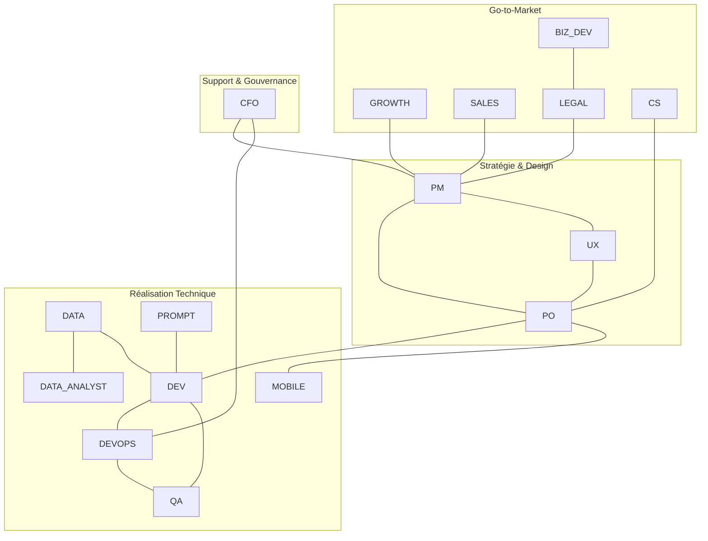

# Index des Rôles - Synapse B2B

Ce répertoire contient les définitions de rôles et les directives opérationnelles pour l'équipe Synapse B2B. Chaque document détaille les responsabilités, les standards techniques et les modes de collaboration spécifiques.

## 1. Index des Rôles

### Produit et Design
- [Product Manager (PM)](PM.md) : Vision stratégique et roadmap.
- [Product Owner (PO)](PO.md) : Gestion du backlog et spécifications fonctionnelles.
- [UX/UI Designer (UX)](UX.md) : Expérience utilisateur et visualisation de données.

### Ingénierie et Data
- [Développeur Fullstack (DEV)](DEV.md) : Architecture web et services backend.
- [Développeur Mobile (MOBILE)](MOBILE.md) : Applications iOS et Android.
- [Data Engineer (DATA)](DATA.md) : Pipelines d'ingestion et modélisation ClickHouse.
- [Data Analyst (DATA_ANALYST)](DATA_ANALYST.md) : Analyse de données et insights décisionnels.
- [DevOps Engineer (DEVOPS)](DEVOPS.md) : Infrastructure, CI/CD et observabilité.
- [Prompt Engineer (PROMPT)](PROMPT.md) : Optimisation des interactions LLM.

### Qualité et Agilité
- [QA Engineer (QA)](QA.md) : Fiabilité, tests E2E et intégrité des données.
- [Scrum Master (SCRUM)](SCRUM.md) : Facilitateur agile et levée d'obstacles.

### Business et Client
- [Growth Marketer (GROWTH)](GROWTH.md) : Acquisition et expérimentation.
- [Business Developer (BIZ_DEV)](BIZ_DEV.md) : Partenariats et expansion.
- [Sales Engineer (SALES)](SALES.md) : Qualification technique et démonstrations.
- [Customer Success Manager (CS)](CS.md) : Adoption, rétention et support.

### Gouvernance et Finance
- [Legal & Compliance (LEGAL)](LEGAL.md) : RGPD, conformité LinkedIn et contrats.
- [CFO / Finance (CFO)](CFO.md) : Pilotage financier et unit economics.

## 2. Carte des Interactions

La collaboration entre les rôles est structurée autour de flux de valeur transverses :

### Flux Principaux
1. **Cycle de Livraison** : PM -> PO -> DEV/MOBILE -> QA -> DEVOPS.
2. **Chaîne de Donnée** : API LinkedIn -> DATA -> ClickHouse -> DATA_ANALYST -> UX -> Utilisateur.
3. **Boucle de Feedback** : Utilisateur -> CS/SALES -> PO -> PM.
4. **Intelligence Artificielle** : DATA -> PROMPT -> DEV -> Utilisateur.
5. **Cadre de Risque** : LinkedIn API Changes -> LEGAL -> PM -> PO -> DATA.
